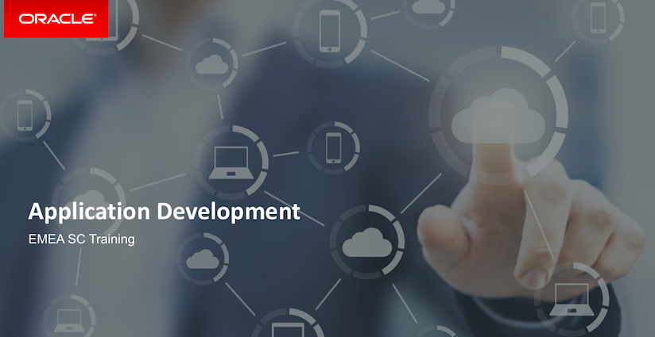

``

## ORACLE Java and Cloud Native Application Development with the Oracle Cloud ##

### Prerequisites ###

#### Oracle Public Cloud PaaS  account

The workshop is intended to work with an Oracle GSE account. You should receive email with access details prior to this event. Get the following account details ready to complete the tutorial and replace to your values when it is required:

+ Oracle Cloud account **username** and **password**
+ Oracle Cloud **identity domain**
+ **Data center/region**

#### Client tools

To complete certain labs you must have installed:

- [Kubernetes command line tool (kubectl)](https://kubernetes.io/docs/tasks/tools/install-kubectl/)
- [cURL](https://curl.haxx.se/)

or [download the prepared VirtualBox appliance](https://drive.google.com/open?id=1DDVwiZ6Pd885LinbnDkcpjMGXN5AeQ48) which contains all the necessary tools. To install VirtualBox follow this [link](https://www.virtualbox.org/wiki/Downloads).

The content contains several independent modules that cover different aspects of the application development in the Oracle Cloud. These modules could be executed independently unless you find in the Prerequisites that they are dependent on each other.

| **AppDev Track** |  |
|-------------|----------------------------------------------------------------------------------------------------------------------------------------------------------------------------|
| 9:00-9:15 | Introduction to workshop |
| 9:15-9:45 |  Oracle Developer Cloud Service |
| 9:45-10:30 |  WebLogic on Oracle Cloud Services - Java Cloud  - WebLogic on Oracle Managed Kubernetes|
| **10:30-10:45** | **Coffee break** |
| 10:45-13:00 | Cloud Native Applications - Application Container Cloud Service - Oracle Microservices Cloud Service - Helidon |
| **13:00-14:00** | **Lunch** |
| 14:00-14:45 | [Java Cloud Service Policy Based Auto Scaling](https://github.com/dvukmano/learning-library/blob/master/workshops/cloud-native-devops-workshop/jcs-autoscale/README.md) |
| 14:45-15:15 | [Cloning a Java Cloud Service Instance Using a Snapshot](https://github.com/dvukmano/learning-library/blob/master/workshops/cloud-native-devops-workshop/jcs-clone/README.md) |
| **15:15-15:30** | **Coffee break** |
| 15:30-16:10 | [Deploy application to WebLogic running on Kubernetes (OKE)](https://github.com/nagypeter/weblogic-kubernetes-operator-on-OKE/blob/master/tutorials/sample.app.pipeline.md) |
| 16:10-16:30 | [Deploy Application directly from Github to Application Container Cloud Service](https://github.com/nagypeter/angular-java-creditscore/blob/master/github.deploy.accs.md) |
| 16:30-17:00 | [Helidon Demo]() |
